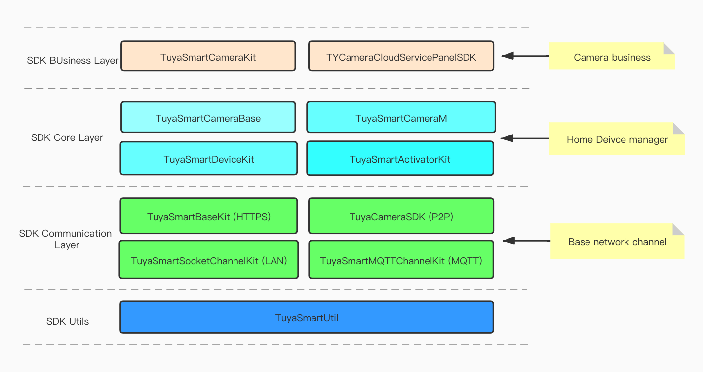

# SDK architecture

## SDK architecture

### Introduction

Tuya Smart Camera iOS SDK encapsulated the camera features base on Tuya Smart Home iOS SDK. The SDK is divided into four parts: Utils, Communication Layer，Core layer, Business Layer.

* Utils provides some common tools method，ex: JSON serialization, string codec.
* Communication Layer encapsulated  HTTP，MQTT，Socket，p2p network channels.
* Core layer provides user, home ,device management, and basic function of camera.
* Business Layer provides extension functions, alarm messages management, cloud storage management and other business functions。

### Architecture diagram

**Modules**

| Module                       | Description                                                  |
| ---------------------------- | ------------------------------------------------------------ |
| TuyaSmartCameraKit           | Camera extension functions, cloud storage, alarm messages management |
| TYCameraCloudServicePanelSDK | Tuya cloud storage service order management                  |
| TuyaSmartCameraBase          | Camera basic function interfaces                             |
| TuyaSmartCameraM             | Camera basic function implementations                        |
| TuyaSmartDeviceKit           | Home and Device management                                   |
| TuyaSmartActivatorKit        | Network configuration                                        |
| TuyaSmartBaseKit             | User management and Tuya server https common interface       |
| TuyaCameraSDK                | Tuya p2p network channel implementation                      |
| TuyaSmartSocketChannelKit    | Tuya socket network channel implementation                   |
| TuyaSmartMQTTChannelKit      | Tuya MQTT network channel implementation                     |
| TuyaSmartUtil                | Common tools method                                          |

